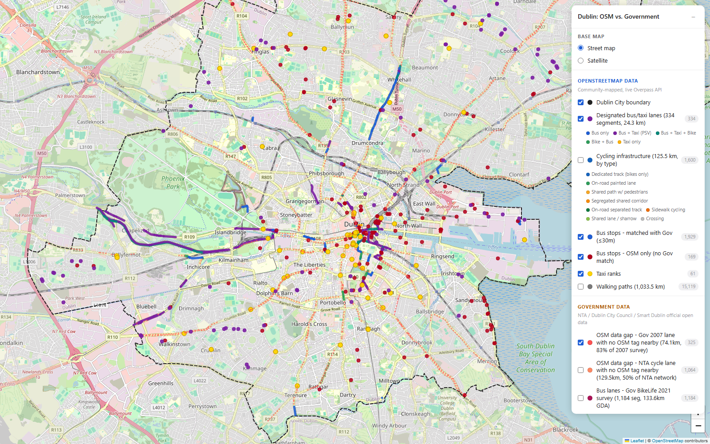

<h1 align="center">Dublin Transport Infrastructure: OpenStreetMap vs. Government Open Data</h1>
<p align="center"><i>A live-data comparison of bus, taxi, cycling and walking infrastructure between OpenStreetMap and eight official Irish government datasets.</i></p>

<p align="center">
  <a href="maps/dublin_osm_vs_gov_map.html"></a>
</p>
<p align="center"><sub>Screenshot of the live interactive map — <a href="maps/dublin_osm_vs_gov_map.html">open <code>maps/dublin_osm_vs_gov_map.html</code></a> for the real thing (pan/zoom, satellite view, click-for-detail popups).</sub></p>

---

## Contents

- [Why I built this](#why-i-built-this)
- [What's in here](#whats-in-here)
- [Headline findings](#headline-findings)
- [Complete numbers: OSM vs. Government](#complete-numbers-osm-vs-government) — every count, km, and km² behind the headlines
- [The map](#the-map)
- [Data sources](#data-sources)
- [Repository structure](#repository-structure)
- [Reproducing this](#reproducing-this)
- [Methodology honesty](#methodology-honesty)
- [License](#license)

---

## Why I built this

I wanted to know a simple-sounding question — **how complete and accurate is OpenStreetMap's picture of Dublin's transport infrastructure, compared to what the government actually says exists?** — and it turned out to have a genuinely interesting, non-obvious answer that took real cross-referencing to get right.

This isn't a toy dataset. Every number below comes from live OSM Overpass API queries and eight real Irish government open-data sources, cross-verified against each other with actual spatial analysis (point matching, buffered overlap, route-by-route diffing) rather than eyeballed comparisons. Where my own first-pass analysis was wrong, I've left that in the methodology notes rather than quietly fixing it — the corrections are part of the finding.

## What's in here

- **One interactive map** (open directly in any browser, no server needed) — Dublin City comparison as the primary view, with the full Greater Dublin Area cycling/walking data available as a collapsible third panel section, same file
- **A full written analysis** with every headline number sourced and cross-checked
- **All the source code** that produced them, in the order it was run
- **Processed datasets** backing every figure in the report

## Headline findings

| Question | Answer |
|---|---|
| How well does OSM cover Dublin's official bus routes? | **50.6%** — only half of the 172 official Dublin Bus/Go-Ahead routes have a matching OSM relation. Go-Ahead Ireland's network is especially under-mapped. |
| How well does OSM cover Dublin's bus stops? | Very well — **91.9–95.1%** mutual match rate against the official GTFS feed (median distance 4.8m). |
| How much of the government's documented bus lane network is missing from OSM? | **83.2%** of the 2007 survey's Dublin City lanes have no OSM tag. Combining the 2007 and 2021 government surveys properly (dedup'd, not just added) puts the real GDA-wide bus lane network at **~217 km** — OSM currently tags 61.26 km of it. |
| Are there taxi-only lanes in Dublin? | No — every taxi-permitted road segment I found is also bus-permitted (Ireland's shared PSV lane convention). |
| Is OSM's cycling data comparable to the government's? | Only if you match definitions carefully — a naive comparison overstates the gap by ~4x, once mixed area scopes and "strict vs. broad" cycling-infrastructure definitions are properly reconciled. |
| Does an official government footpath dataset exist? | No — confirmed by genuine search of every known Irish open-data portal, not assumed. OSM is the only usable source for Dublin's pedestrian network. |

Full detail, methodology, and every caveat: **[`reports/ANALYSIS_REPORT.md`](reports/ANALYSIS_REPORT.md)**

## Complete numbers: OSM vs. Government

Everything below is area-normalized and buffer-tolerant matched (never exact-geometry, never mismatched boundaries — see [Methodology honesty](#methodology-honesty)). Full derivation and every intermediate figure: [`reports/ANALYSIS_REPORT.md`](reports/ANALYSIS_REPORT.md).

**Study area:** Dublin City Council boundary = **117.60 km²** · Greater Dublin Area (4 local authorities) = **921 km²**

### Bus stops (points)

| | OSM | Government (GTFS) |
|---|---:|---:|
| Points, Dublin City | 2,098 | 1,879 |
| Matched to the other source (≤30m) | 1,929 (91.9%) | 1,786 (95.1%) |
| Unmatched | 169 | 93 |

Median match distance **4.8 m** (p90 = 23 m, p95 = 54 m). Within Dublin City, OSM actually has *more* distinct stop points than GTFS, not fewer — the naive unclipped GTFS total (5,033, including Kildare/Wicklow/Fingal commuter stops) is not a fair comparison.

### Bus routes (count)

| | OSM | Government (GTFS, Dublin-filtered) |
|---|---:|---:|
| Distinct routes | 108 (220 relations, Dublin Bus + Go-Ahead) | **172** |
| Matched | 87 | 87 |
| Source-only | 21 | **85 missing from OSM** |

**Only 50.6% of official Dublin bus routes have a corresponding OSM relation.** The gap is concentrated in Go-Ahead Ireland's network (routes 102, 104, 111, 114, 116, 142, 150, 151, 161, 197, the entire "L" Local Link series) plus lettered variants and night (`n`-suffix) services.

### Taxi infrastructure

| | OSM | Government |
|---|---:|---:|
| Count | **61** (58 nodes + 3 ways) | **195** bye-law schedule rows |
| Has coordinates? | Yes | **No — legal text only** |

195 is a row count, not a unique-location count (a stand can recur across schedules). **OSM is the only source that lets you place Dublin's taxi ranks on a map.**

### Designated bus/taxi lane road segments (km)

| Source | Scope | Segments | Length |
|---|---|---:|---:|
| OSM (current, live) | Dublin City | 334 | **24.31 km** |
| OSM (current, live) | Greater Dublin Area | 652 | **61.26 km** |
| Government — 2007 GDA Bus Lane Survey | GDA, all categories | 555 | **186.58 km** |
| Government — 2007 GDA Bus Lane Survey | GDA, Category 1 only | 470 | 178.71 km |
| Government — 2007 GDA Bus Lane Survey | clipped to Dublin City | — | **89.08 km** |
| Government — NTA BikeLife 2021 (`buslane` flag) | GDA | 1,184 | **133.55 km** |

OSM by allowed-vehicle category (Dublin City): bus-only 92 segs / 5.03 km, bus+taxi (PSV) 179 / 13.79 km, bike+bus+taxi 50 / 4.66 km, bike+bus 12 / 0.70 km, taxi-only 1 / 0.13 km. **No taxi-exclusive lanes exist anywhere.**

**Gap, Dublin City (20 m buffer tolerance):**

| | Confirmed by the other source | Gap |
|---|---:|---:|
| 2007 government lanes vs. OSM | 16.8% (14.95 km) | **83.2% (74.13 km)** |
| OSM lanes vs. 2007 government | 60.9% (14.79 km) | 39.1% (9.52 km — plausibly newer lanes built since 2007) |

**Combining the two government surveys — naive sum vs. real unique total:**

| | Value |
|---|---:|
| Naive sum (2007 Cat.1 + BikeLife, no dedup) | 312.26 km |
| Exact-geometry "dedup" (wrong — different CRS defeats vertex matching) | ~312 km (~0% detected overlap) |
| **Buffer-tolerant unique total (15 m, validated)** | **~217 km** |

The naive 312 km double-counts the same physical lanes recorded twice, 14 years apart, in different coordinate systems. The correct combined government-documented network is **~217 km**, against which OSM currently tags 61.26 km GDA-wide — **OSM covers roughly 28% of the real network.**

### Cycling infrastructure (km)

**OSM, Dublin City — 1,600 segments, 125.52 km total, by type:**

| Type | Segments | Length |
|---|---:|---:|
| Dedicated cycle-only track | 612 | 38.84 km |
| Shared corridor (segregated bike+pedestrian) | 110 | 26.04 km |
| On-road painted lane | 266 | 25.58 km |
| Shared path (unsegregated bike+pedestrian) | 350 | 24.54 km |
| Separated track alongside road | 25 | 5.15 km |
| Shared lane / sharrow | 12 | 2.30 km |
| Crossing | 189 | 1.70 km |
| Cycling on sidewalk | 36 | 1.37 km |

**Government:**

| Source | Scope | Length |
|---|---|---:|
| NTA Active Travel Cycle Network (2025) | GDA | 973.55 km |
| NTA Active Travel Cycle Network (2025) | Dublin City (clipped) | **259.88 km** |
| DCC / Smart Dublin Protected & Segregated Infra (2013–2023) | Dublin City (clipped) | **96.56 km** |
| 2007 GDA Cycletrack Survey | GDA | **691.75 km** |

**OSM, Greater Dublin Area — definition matters (resolves a disputed comparison):**

| Definition | Ways | Length |
|---|---:|---:|
| Strict (same rule as the 125.52 km Dublin City figure) | 6,798 | 698.19 km |
| Broad (+bike-permitted footways/paths/tracks, +any `cycleway:left/right/both`) | 21,517 | **2,374.27 km** |

A disputed "2,464 km GDA" figure is real under the *broad* definition (within 3.6%) — comparing it to the 125.52 km *strict* figure was an invalid cross-definition comparison, not a real ~20x gap. Same-definition, area-adjusted increase city→region: **5.6x**.

**Gap analysis, Dublin City (15 m buffer):**

| | Confirmed by other source | Gap |
|---|---:|---:|
| OSM vs. NTA | 78.5% | 21.5% |
| NTA vs. OSM | 50.0% | **50.0%** |
| OSM vs. DCC protected | 44.0% | 56.0% |
| DCC protected vs. OSM | 58.5% | 41.5% |
| NTA vs. DCC protected | 39.5% | 60.5% |
| DCC protected vs. NTA | **98.2%** | 1.8% |

The last row is an internal-consistency check: DCC's protected-cycle dataset is 98.2% a subset of NTA's broader network — two independent government sources agree almost perfectly, which is what makes the 50% OSM gap trustworthy rather than a measurement artifact.

### Walking infrastructure (km) — OSM only, no government dataset exists

| Scope | Features | Length |
|---|---:|---:|
| Dublin City | 15,119 | **1,033.5 km** |
| Full Greater Dublin Area | 55,100 | **4,245.0 km** |

No official government footpath/footway dataset exists — confirmed by genuine search across data.gov.ie and data.smartdublin.ie, not assumed. A disputed "60,276" GDA figure was traced to an unclipped bounding-box query leaking into Meath/Kildare/Wicklow (a 9.4% overcount from boundary imprecision, not fabrication).

### Location-accuracy verification

Every named designated-lane segment (303 of 334) was reverse-geocoded via Nominatim and checked against its own OSM `name` tag: **288 / 303 (95%) matched exactly.** The 15 "mismatches" are all bridges/quays/short junction streets where the geocoder returns an *adjacent* street name — a geocoding-precision artifact, not misplaced data. **The underlying OSM coordinate data is accurate.**

---

## The map

**[`maps/dublin_osm_vs_gov_map.html`](maps/dublin_osm_vs_gov_map.html)** — one file, three panel sections:

| Section | Scope | What's on it |
|---|---|---|
| **OpenStreetMap Data** | Dublin City Council (117.6 km²) | Designated bus/taxi lanes (by allowed vehicle type), cycling infrastructure (classified by type: dedicated track, on-road lane, shared path...), bus stops (matched / OSM-only), taxi ranks, walking paths |
| **Government Data** | Dublin City Council, clipped to match | GTFS-only bus stops, NTA/DCC cycling networks, the 2007 bus lane & cycletrack surveys, BikeLife 2021, and the computed OSM-data-gap layers |
| **Regional Data (Greater Dublin Area)** — collapsed by default | Full GDA (921 km², all 4 local authorities) | OSM cycling under two definitions (strict vs. broad) and the full walking network, for the wider-scope picture beyond the city core |

Satellite view, full click-for-detail popups with Google Street View links on every feature (city-scope layers; regional-scope layers use lightweight hover tooltips given their size — 21.5k / 55k features). Download the file and open it in a browser — everything is self-contained except map tiles, which need an internet connection.

## Data sources

**OpenStreetMap** — live Overpass API queries, September 2026.

**Government (8 sources):**

| Dataset | Publisher | Year |
|---|---|---|
| NTA static GTFS feed | National Transport Authority | 2026 (current) |
| Taxi Rank Bye-Laws (Schedules 1-4) | Dublin City Council | current |
| Active Travel Cycle Network | NTA | 2025 |
| Existing Protected Cycle Infrastructure | DCC / Smart Dublin | 2013-2023 |
| GDA Bus Lane Survey | Dublin Transportation Office / NTA | 2007 |
| GDA Cycletrack Survey | Dublin Transportation Office | 2007 |
| BikeLife Survey | NTA | 2013-2021 |

## Repository structure

```
dublin-mobility-analysis/
├── README.md                    this file
├── LICENSE
├── requirements.txt
├── docs/
│   └── images/                  README screenshots
├── reports/
│   └── ANALYSIS_REPORT.md       full write-up: every number, sourced and cross-checked
├── maps/                        the deliverable — open directly in a browser
│   └── dublin_osm_vs_gov_map.html
├── src/                         all analysis code, in the order it was run (01 -> 22)
│   ├── 01_fetch_boundary.py             resolve the real Dublin City Council polygon
│   ├── 02_column_profile.py             profile every field in every dataset (not just headline counts)
│   ├── 03_route_comparison.py           OSM vs. GTFS bus route diffing
│   ├── 04_spatial_clip.py               clip government data to a matching boundary
│   ├── 05_stop_matching.py              nearest-neighbor bus stop matching
│   ├── 06-08                            map-layer preparation & size optimization
│   ├── 09-14                            designated bus/taxi lane extraction & classification (city + regional)
│   ├── 15                               process the 2007 government bus lane survey (CRS reprojection)
│   ├── 16                               reverse-geocode verification of lane locations
│   ├── 17-18                            spatial gap analysis: OSM vs. government, bus lanes & cycling
│   ├── 19                               overlap-detection methodology check (2007 vs. 2021 gov surveys)
│   ├── 20-21                            process BikeLife 2021 + 2007 cycletracks + regional walking data
│   └── 22                               build the regional companion map
└── data/processed/               every intermediate result and map layer, so nothing here is a black box
```

Raw source downloads (GTFS zip, shapefiles, raw Overpass API responses) aren't committed — they're large, and every download URL is in the relevant script's docstring so the whole pipeline is reproducible from scratch.

## Reproducing this

```bash
pip install -r requirements.txt
cd src
python 01_fetch_boundary.py
python 02_column_profile.py
# ... run in numeric order; each script documents what it needs in its docstring
```

Everything hits live public APIs (Overpass, Nominatim, data.gov.ie, data.smartdublin.ie) — no API keys required.

## Methodology honesty

A few things I want on the record rather than buried:

- I caught and fixed a real bug in my own boundary-clipping code mid-analysis (a Python `and/or`-as-ternary mistake that briefly made it look like 0% of government stops were in Dublin City). It's documented in the report, not quietly patched out.
- The 2007-vs-2021 government bus lane "overlap" figure in one early pass of this analysis used exact-geometry matching between two datasets in *different coordinate systems* — which by construction finds ~0% overlap regardless of the real answer. The corrected, buffer-tolerant figure (~217 km unique network, not the naive ~312 km sum) is in the report and in [Complete numbers](#complete-numbers-osm-vs-government) above.
- Two OSM statistics I checked (a 2,464 km cycling figure and a 60,276 walkway-feature count) turned out to be real numbers under different definitions/boundaries than I'd first assumed, not fabricated — the report shows exactly how they were reconciled.

## License

MIT — see [`LICENSE`](LICENSE). Government data used here is republished under the license terms of the original sources (Creative Commons Attribution 4.0 for the data.gov.ie / Smart Dublin datasets); OpenStreetMap data is © OpenStreetMap contributors, ODbL.
